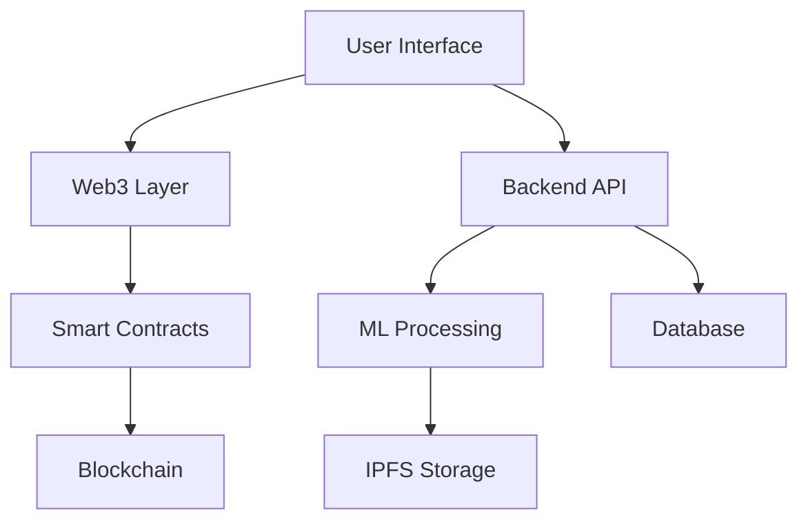

# EmoTrade: Blockchain-Based Emotion Marketplace 🌟

[](https://opensource.org/licenses/MIT)
[](https://soliditylang.org/)
[](https://reactjs.org/)
[](https://nodejs.org/)

## Vision 🎯
EmoTrade revolutionizes human connection by creating a secure, transparent marketplace for sharing and trading authentic emotional experiences using blockchain technology. Each emotional moment is captured, validated, and tokenized, creating a unique digital asset that preserves human experiences forever.

## Core Features 🚀

- **Emotion Capture Engine**: AI-powered system to record and validate emotional experiences
- **Emotion NFT Minting**: Convert verified emotions into unique NFTs
- **Experience Marketplace**: Trade and collect emotional experiences
- **Authenticity Verification**: ML-based emotion validation system
- **Community Curation**: DAO-governed content moderation
- **Experience Fusion**: Combine multiple emotions to create unique experiences

## Technology Stack 💻

### Blockchain Layer
- **Smart Contracts**: Solidity 0.8.x
- **Blockchain**: Ethereum/Polygon
- **NFT Standard**: ERC-721A
- **Framework**: Hardhat
- **Testing**: Chai, Mocha
- **Libraries**: OpenZeppelin

### Backend
- **Runtime**: Node.js 16.x
- **Framework**: Express.js
- **Database**: MongoDB
- **Cache**: Redis
- **Queue**: RabbitMQ
- **ML Server**: Python/TensorFlow

### Frontend
- **Framework**: React 18
- **State Management**: Redux Toolkit
- **Styling**: Tailwind CSS
- **Web3**: ethers.js
- **UI Components**: Material-UI
- **Charts**: D3.js

### AI/ML Components
- **Emotion Detection**: TensorFlow
- **Natural Language**: Hugging Face Transformers
- **Audio Processing**: Librosa
- **Video Analysis**: OpenCV
- **Sentiment Analysis**: BERT

### DevOps
- **Container**: Docker
- **Orchestration**: Kubernetes
- **CI/CD**: GitHub Actions
- **Monitoring**: Grafana/Prometheus
- **Cloud**: AWS

## Architecture 🏗️



## Smart Contract Architecture 📝

```solidity
contract EmoTrade {
    struct Emotion {
        uint256 id;
        address creator;
        string ipfsHash;
        uint256 intensity;
        uint256 timestamp;
        bool verified;
    }

    mapping(uint256 => Emotion) public emotions;
    mapping(address => uint256[]) public userEmotions;
}
```

## Getting Started 🌱

### Prerequisites
```bash
node -v  # v16.x
npm -v   # v8.x
```

### Installation
```bash
# Clone repository
git clone https://github.com/emotrade/emotrade-platform.git

# Install dependencies
npm install

# Configure environment
cp .env.example .env

# Start development server
npm run dev
```

## Testing 🧪

```bash
# Run smart contract tests
npx hardhat test

# Run backend tests
npm run test:backend

# Run frontend tests
npm run test:frontend
```

## Contributing 🤝

1. Fork the repository
2. Create feature branch (`git checkout -b feature/amazing-feature`)
3. Commit changes (`git commit -m 'Add amazing feature'`)
4. Push to branch (`git push origin feature/amazing-feature`)
5. Open Pull Request

## Roadmap 🛣️

- [x] Smart Contract Development
- [x] Emotion Capture System
- [ ] ML Model Training
- [ ] Marketplace Launch
- [ ] Mobile App Development
- [ ] Cross-chain Integration

## License 📄
MIT License - see [LICENSE.md](LICENSE.md)

## Contact 📧
Project Link: [https://github.com/emotrade/emotrade-platform](https://github.com/emotrade/emotrade-platform)

## Acknowledgments 🙏
- OpenZeppelin Contracts
- IPFS
- TensorFlow Team
- Ethereum Community
